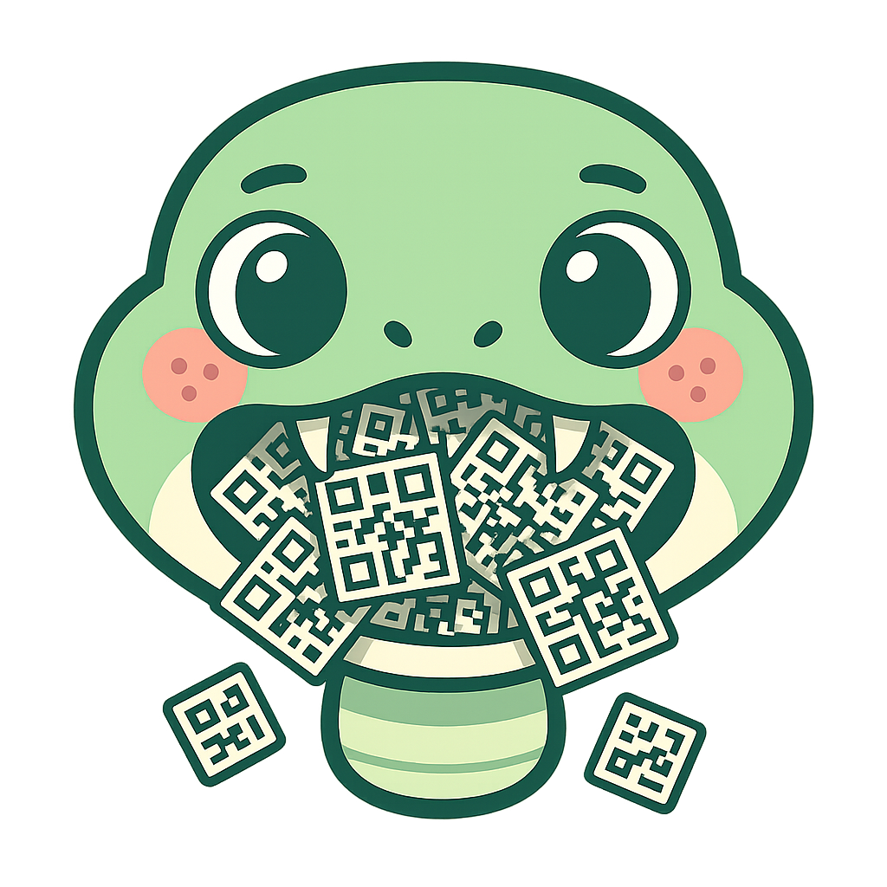

# SegnoMMS

<div align="center">
  
</div>

[](https://badge.fury.io/py/segnomms)
[](https://pypi.org/project/segnomms/)
[](https://opensource.org/licenses/MIT)
[](https://github.com/systmms/segnomms/actions/workflows/test.yml)

Advanced QR code generation plugin for [Segno](https://github.com/heuer/segno) with custom shapes, styling, interactivity, and **comprehensive Pydantic integration** for type-safe configuration management. Powers the QR code generation at [qrcodemms.com](https://www.qrcodemms.com).

## Features

- **🔧 Pydantic-Powered Configuration**: Complete type safety with automatic validation, JSON Schema generation, and structured data models throughout the entire codebase
- **🎨 Custom Shapes**: Multiple shape options for QR modules (dots, rounded, squares, diamonds, squircles, etc.)
- **⚡ Interactive Elements**: CSS classes for hover effects, tooltips, and click handling
- **🔗 Connected Modules**: Smart shape connection for adjacent modules (pill shapes, flowing designs)
- **🎯 Per-Component Styling**: Different shapes for different QR components (finder patterns, data modules, etc.)
- **🎨 CSS Variables**: Dynamic styling through CSS custom properties
- **♿ Comprehensive Accessibility**: WCAG compliance, ARIA labels, stable IDs, pattern-specific labeling, and screen reader optimization
- **🛡️ Type Safety**: Full type checking, constraint validation, and IDE support for all parameters
- **📊 Structured Data**: Rich data models instead of dictionaries with computed properties and validation
- **🔌 API Integration**: JSON Schema generation perfect for FastAPI, OpenAPI, and external tools

## Installation

### Using pip

```bash
pip install segnomms
```

### For Development (Recommended: Using uv)

SegnoMMS uses [uv](https://github.com/astral-sh/uv) for ultra-fast dependency management:

```bash
# Install uv (if not already installed)
pip install uv

# Clone and setup
git clone https://github.com/systmms/segnomms.git
cd segnomms

# Install with uv (10-100x faster than pip!)
uv sync
uv pip install -e .

# Or use the Makefile
make setup
```

Traditional pip development setup:
```bash
git clone https://github.com/systmms/segnomms.git
cd segnomms
pip install -e .
```

## Usage

```python
import segno
from segnomms import write

# Create QR code
qr = segno.make('Hello World')

# Generate interactive SVG with custom shapes
write(qr, 'output.svg',
    scale=10,
    shape='rounded',
    data_shape='dot',
    finder_shape='rounded',
    finder_inner_shape='square',
    merge='soft',  # Connect adjacent modules
    interactive=True
)
```

### Accessibility Features

```python
import segno
from segnomms import write
from segnomms.a11y.accessibility import AccessibilityConfig, create_enhanced_accessibility

# Generate QR code with comprehensive accessibility
qr = segno.make('Accessible QR Code')
accessibility_config = create_enhanced_accessibility()

write(qr, 'accessible.svg',
    scale=10,
    shape='rounded',
    accessibility=accessibility_config
)

# Custom accessibility configuration
from segnomms.a11y.accessibility import AccessibilityConfig, AccessibilityLevel

custom_a11y = AccessibilityConfig(
    id_prefix="qr",
    target_compliance=AccessibilityLevel.AAA,
    enable_aria=True,
    include_pattern_labels=True,
    enable_keyboard_navigation=True,
    root_label="Interactive QR Code"
)

write(qr, 'custom-accessible.svg', accessibility=custom_a11y)
```

## Shape Options

### Basic Shapes
- `square` - Classic square modules
- `circle` - Circular dots
- `rounded` - Rounded squares
- `dot` - Small dots with gaps
- `diamond` - Diamond shapes
- `hexagon` - Hexagonal modules
- `star` - Star shapes
- `plus` - Plus/cross shapes

### Connection Styles
- `none` - No connection between modules
- `pill` - Connect horizontal/vertical neighbors into pills
- `flow` - Smooth flowing connections
- `merge` - Fully merge connected regions

### Interactive Features
- Hover highlighting
- Click handlers via data attributes
- Tooltips showing module information
- Custom CSS classes per module type

## Requirements

- Python >= 3.9
- Segno >= 1.5.2 (tested with 1.5.2, 1.6.0, and 1.6.6)
- Pydantic >= 2.7,<3 (for configuration validation and JSON Schema)

### Optional Dependencies

- For accessibility features: All included in base installation
- For development: use `make setup` (uv) or install extras `[docs,test]` from `pyproject.toml`

## Quick Start

```python
import segno
from segnomms import write

# Create a QR code with custom shapes
qr = segno.make("https://example.com")
write(qr, "output.svg", shape="circle", dark="#1a1a2e", scale=10)
```

## Configuration Management

SegnoMMS features comprehensive **Pydantic-powered configuration** with automatic validation, type safety, and JSON Schema generation throughout the entire codebase:

### Type-Safe Configuration with Full Validation

```python
from segnomms.config.models.core import RenderingConfig
from segnomms.validation.models import Phase4ValidatorConfig
from segnomms.algorithms.models import ClusteringConfig
from pydantic import ValidationError

# Main configuration with automatic validation
config = RenderingConfig.from_kwargs(
    shape='squircle',
    corner_radius=0.3,
    connectivity='8-way',
    merge='soft'
)

# Component-specific validation models
validator_config = Phase4ValidatorConfig(
    qr_version=7,
    error_level='M',
    matrix_size=45
)

clustering_config = ClusteringConfig(
    min_cluster_size=5,
    density_threshold=0.7,
    connectivity_mode='8-way'
)

# Invalid values raise clear validation errors with helpful messages
try:
    bad_config = RenderingConfig.from_kwargs(shape='invalid', scale=-5)
except ValidationError as e:
    for error in e.errors():
        print(f"{error['loc']}: {error['msg']}")
```

### Structured Data Models Throughout

```python
from segnomms.core.models import NeighborAnalysis
from segnomms.algorithms.models import ClusterInfo
from segnomms.validation.models import ValidationResult
from segnomms.core.detector import ModuleDetector
from segnomms.config.models.core import RenderingConfig

# Example setup
config = RenderingConfig.from_kwargs()
# Create a minimal QR matrix for version 1 (21x21)
matrix = [[True] * 21 for _ in range(21)]
detector = ModuleDetector(matrix, version=1)
row, col = 10, 10

# Structured returns instead of dictionaries
analysis = detector.get_weighted_neighbor_analysis(row, col)
print(f"Flow direction: {analysis.flow_direction}")
print(f"Connectivity: {analysis.connectivity_strength}")

# Rich cluster information with computed properties
cluster = ClusterInfo(
    positions=[(0,0), (0,1), (1,0)],
    bounds=(0, 0, 1, 1),
    module_count=3,
    density=0.75,
    aspect_ratio=1.0,
    is_rectangular=False
)
print(f"Cluster size: {cluster.width}x{cluster.height}")
print(f"Fill ratio: {cluster.fill_ratio}")

# Comprehensive validation results
from segnomms.validation.phase4 import Phase4Validator
validator = Phase4Validator(qr_version=1, error_level='M', matrix_size=21)
result = validator.validate_all(config)
print(f"Valid: {result.valid}")
print(f"Issues: {result.total_issues}")
```

### JSON Schema Generation & Integration

```python
from segnomms.config.models.core import RenderingConfig
from segnomms.algorithms.models import ClusteringConfig

# Generate JSON Schema for any configuration
schema = RenderingConfig.model_json_schema()
clustering_schema = ClusteringConfig.model_json_schema()

# Rich schemas with constraints and descriptions
print(schema['properties']['scale'])
# Output: {'type': 'integer', 'minimum': 1, 'maximum': 100, 'description': 'Size of each module in pixels'}

# Perfect for FastAPI integration
try:
    from fastapi import FastAPI
    app = FastAPI()

    @app.post("/qr/generate")
    def generate_qr(config: RenderingConfig):
        return {"svg": f"<svg>Generated QR with {config.geometry.shape}</svg>"}

    @app.get("/qr/schema")
    def get_schema():
        return RenderingConfig.model_json_schema()
    print("FastAPI integration ready")
except ImportError:
    print("FastAPI not available - install with: pip install fastapi")
```

### Configuration Serialization & Presets

```python
from segnomms.config.models.core import RenderingConfig
from segnomms.algorithms.models import ClusteringConfig

# Create example configurations
config = RenderingConfig.from_kwargs(shape='squircle', corner_radius=0.4)
clustering_config = ClusteringConfig()

# Serialize any configuration to JSON
json_string = config.model_dump_json()
cluster_json = clustering_config.model_dump_json()

# Restore from JSON with validation
restored_config = RenderingConfig.model_validate_json(json_string)
restored_cluster = ClusteringConfig.model_validate_json(cluster_json)

# Create configuration presets
PRESET_MODERN = RenderingConfig.from_kwargs(
    shape='squircle',
    corner_radius=0.4,
    connectivity='8-way',
    merge='soft'
)

PRESET_CLASSIC = RenderingConfig.from_kwargs(
    shape='square',
    connectivity='4-way',
    merge='none'
)
```

### IDE Support & Type Safety

All models provide complete type hints and IDE auto-completion:

```python
from segnomms.config.models.core import RenderingConfig

# Full IDE support with type checking
def process_qr(config: RenderingConfig) -> str:
    # IDE knows all available fields and their types
    scale: int = config.scale
    shape: str = config.geometry.shape
    # Automatic validation ensures type safety
    return f"<svg>Generated SVG with {shape} at scale {scale}</svg>"
```

## License

SegnoMMS is open source software licensed under the MIT License. See the [LICENSE](LICENSE) file for details.

## Acknowledgments

- Built for [Segno](https://github.com/heuer/segno) - Pure Python QR Code generator by Lars Heuer
- "QR Code" is a registered trademark of DENSO WAVE INCORPORATED

## Commercial Use

This plugin is free for both personal and commercial use. You can use it in commercial products, SaaS applications, or any other projects without restrictions.

## Development

### Setting Up the Development Environment

This project uses Nix for reproducible development environments:

1. Install [Nix](https://nixos.org/download.html) and [direnv](https://direnv.net/)
2. Run the setup script:
   ```bash
   ./repo/setup-dev-env.sh
   ```
3. The environment will activate automatically when entering the project directory

### GitHub Actions Testing

Test GitHub Actions workflows locally using `act`:

```bash
# List available workflows
act -l

# Run all workflows
act

# Run specific workflow
act -W .github/workflows/test.yml

# Lint workflow files
actionlint
```

The project includes comprehensive GitHub Actions workflows for testing and validation.

### Git Hooks (Lefthook)

The project uses Lefthook for git hooks to ensure code quality:
- **actionlint**: Validates GitHub Actions workflow syntax
- **black**: Python code formatting
- **isort**: Python import sorting
- **flake8**: Python linting

Install hooks:
```bash
lefthook install
```

Hooks run automatically on commit. To run manually:
```bash
lefthook run pre-commit
```

### Architecture

Based on the Segno plugin architecture:
- Entry point: `segnomms.plugin:write`
- Plugin registration via setuptools entry points
